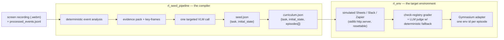
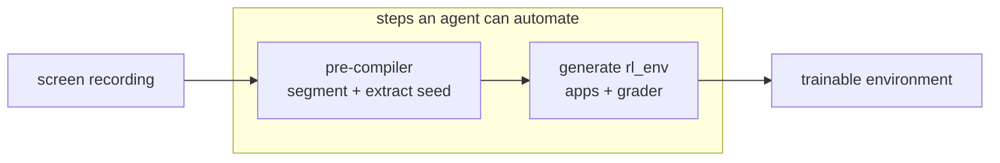

# screen2gym — an environment compiler for computer-use agents

> Turn a raw, action-labeled **screen recording** into a **trainable reinforcement-learning environment**.

`screen2gym` takes a computer-use recording (a screen capture plus its input-event
stream) and compiles it into the two things an RL episode needs:

1. **What task** the user was performing, and
2. **What initial state** each RL episode must reset to before an agent attempts it.

It then boots that seed into a **live, resettable, automatically-graded** multi-app
environment exposed through a standard Gymnasium API — so the recording becomes
something an agent can actually train against.

**▶ Interactive walkthrough (diagrams of what it is / how it works / why):**
**https://marc-saouda.github.io/screen2gym/**

---

## The two halves



| Half | Role | Read more |
| --- | --- | --- |
| [`rl_seed_pipeline/`](rl_seed_pipeline) | **The compiler.** Recording + events → `seed.json` (task + initial_state) and an episodic `curriculum.json`. Deterministic stages do the heavy lifting offline; a single vision-LLM call reads exact on-screen data. | [pipeline README](rl_seed_pipeline/README.md) |
| [`rl_env/`](rl_env) | **The target environment.** Boots the seed into simulated, gradeable apps with a Gymnasium adapter, a reward registry, and an OpenAI judge (with a deterministic fallback). | [env README](rl_env/README.md) |

The example task (from the included recording): *set up and validate a Zapier
automation that posts a formatted real-time booking alert to a Slack channel
(`#crew-alerts`) whenever a new row is added to the "Salt and Stone Booking"
Google Sheet*, for **Salt & Stone Coastal Tours**.

---

## What it produces (the deliverable)

Given the recording, the pipeline emits a structured seed. Abbreviated:

```jsonc
{
  "task": {
    "title": "Automate Booking Alerts from Google Sheets to Slack",
    "goal":  "Create a Zapier automation that sends new booking details ...",
    "success_criteria": [ "A new row triggers a Slack message", ... ]   // objectively checkable
  },
  "initial_state": {                 // what every episode resets to
    "starting_screen": "...",
    "environment": { "accounts_and_auth": ["Google", "Slack", "Zapier"] },
    "resources": [ { "name": "...", "state": "present | to_be_created" } ],  // GIVEN vs PRODUCE
    "seed_data": { "schema": [...], "rows": [ /* all 15 booking records, verbatim */ ] }
  }
}
```

The crucial RL distinction is baked in: `initial_state` separates what is **GIVEN**
at `t=0` (logged-in accounts, the starter dataset) from what the agent must
**PRODUCE** (the sheet, the channel, the Zap), and carries the verbatim `seed_data`
so episodes seed deterministically.

---

## Quickstart

```bash
# 1) Install (Homebrew Python is PEP 668 "externally managed"; the flag mirrors that)
python3 -m pip install --break-system-packages -r rl_env/requirements.txt
python3 -m pip install --break-system-packages -r rl_seed_pipeline/requirements.txt
NODE_TLS_REJECT_UNAUTHORIZED=0 python3 -m playwright install chromium   # for browser-mode

# 2) Provide a key for the AI stages (optional — everything degrades gracefully without it)
cp .env.example .env && $EDITOR .env       # set OPENAI_API_KEY

# 3) Compile a recording into a seed + curriculum
cd rl_seed_pipeline
python3 pipeline.py --events ../<id>_processed_events.jsonl --video ../<id>.webm \
                    --out outputs --model gpt-4o
#   --skip-vlm rebuilds the curriculum offline (no key, no network)

# 4) Run / grade the resulting environment
cd ../rl_env
python3 smoke_test.py                       # full task: real Chromium + OpenAI judge
python3 curriculum_runner.py --mode browser # every episode, oracle + discrimination
```

Drive any episode programmatically:

```python
import gym_env, gymnasium as gym
gym_env.register_envs()
env = gym.make("SaltStone/E3_zap_trigger-v0")
obs, info = env.reset()
obs, reward, terminated, truncated, info = env.step(
    '{"type":"configure_automation","trigger_app":"google_sheets",'
    '"trigger_event":"new_row","trigger_sheet":"Salt and Stone Booking"}')
```

---

## Why this design

- **Deterministic core, tiny VLM tip.** Typed-text reconstruction, app/URL phase
  detection and key-frame selection are deterministic and free; the model is used
  *once*, on a compact high-signal evidence pack. Cheap, reproducible, inspectable.
- **Server-rendered, dual-mode environment.** The simulated apps render from state on
  every request, so a Playwright click and a plain HTTP `POST` hit identical logic.
  Training can run pixel-accurate (browser) or headless-fast (backend) with no
  divergence in task logic or grading.
- **Resettable episodic curriculum.** One recording is sliced into independently
  resettable sub-tasks; each resets to its own cumulative state and is graded by only
  its own checks, so credit assignment is clean and a do-nothing policy scores `< 1.0`.
- **Graceful judge fallback.** The fuzzy LLM judge always carries a deterministic
  cross-check, so the environment grades even with no key/network.

The interactive site visualizes all of this:
**https://marc-saouda.github.io/screen2gym/**

---

## Verification

Both test harnesses pass, including with **real** API/browser calls (see
`rl_env/outputs/*_report.json`):

- `rl_env/curriculum_runner.py` — for every episode, proves it (1) resets to an
  unsolved state, (2) is solved by a minimal oracle (`reward == 1.0`), (3)
  discriminates a deliberately wrong attempt, and (4) round-trips through `gym.make`.
  Verified in real Chromium with the live `gpt-4o-mini` judge, against both the
  hand-written `seed.example.json` and the pipeline-generated `curriculum.json`.
- `rl_env/smoke_test.py` — runs the full task end-to-end and confirms a correct
  alert posts to `#crew-alerts`. Verified in browser mode with the live judge.
- `rl_seed_pipeline/pipeline.py` — verified end-to-end with a real `gpt-4o` vision
  call: 1,197 events parsed, 12 key-frames, all 15 booking rows transcribed.

CI (`.github/workflows/ci.yml`) runs the offline subset on every push.

---

## Scaling the approach

This repository was itself built with an AI coding agent (Cursor), and that is the
core of the scalability argument. The steps that turn a recording into an environment
— segmenting the session, extracting the task/initial-state seed, and generating the
`rl_env` apps and grader — are themselves agent-friendly tasks, not bespoke
hand-engineering. So the approach extends beyond this one recording without rebuilding
it by hand each time:



- **Automate the pre-compiler.** Event segmentation and seed extraction are well-scoped,
  repeatable tasks. A capable agent can do them directly; a small, cheap model can be
  fine-tuned for them; or a strong model can handle a handful of recordings and the rest
  can be few-shot prompted from those examples when they are similar enough.
- **Automate `rl_env` generation.** The same agent-driven process that produced the
  simulated apps and grader here can generate them for new tasks, driven by the seed
  rather than written by hand.
- **App-agnostic.** None of this depends on the specific apps in the recording
  (Sheets / Slack / Zapier here); it is about the structure of a computer-use session,
  so it transfers to other tools and workflows.

This is a direction the design already supports rather than something fully automated
today: the repository demonstrates the end-to-end path on one task, and its artifacts
(`seed.json`, `curriculum.json`, and the per-episode checks) are exactly the interfaces
an agent would target when scaling it up.

---

## Possible extensions

A few concrete, optional directions (none required for the task as posed):

- **Data-driven grader.** The grader currently encodes this task's column roles and
  checks in `rl_env/harness/environment.py`; moving that spec into the seed would let
  other recordings produce environments without code changes.
- **Packaging.** A `pyproject.toml` and a `Dockerfile` would make installs reproducible
  across machines (and remove the `sys.path` shims).
- **Model configuration.** Make the VLM/judge model names and providers configurable,
  and lean on structured outputs.

---

## Repo layout

```
screen2gym/
├─ rl_seed_pipeline/   # the compiler: recording → seed.json + curriculum.json
├─ rl_env/             # the target env: simulated apps + grader + Gymnasium adapter
├─ docs/               # interactive, self-contained explainer (GitHub Pages)
├─ <id>_processed_events.jsonl   # the example event stream (sample input)
├─ .env.example        # copy to .env and add OPENAI_API_KEY (never commit .env)
└─ .github/workflows/  # CI: offline tests
```

> **Note on the sample recording.** The source `.webm` (~313 MB, over GitHub's 100 MB
> limit) is intentionally **not** shipped; the event stream is enough to run the
> deterministic pipeline and the whole environment. Key-frame stills are also excluded
> for privacy. No secrets are committed — `.env` is git-ignored.

## License

[MIT](LICENSE) © 2026 Marc Saouda
