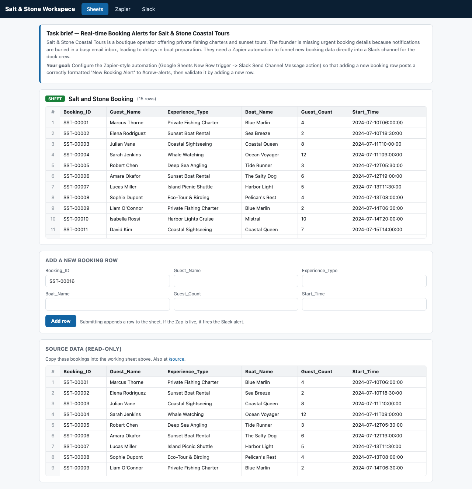
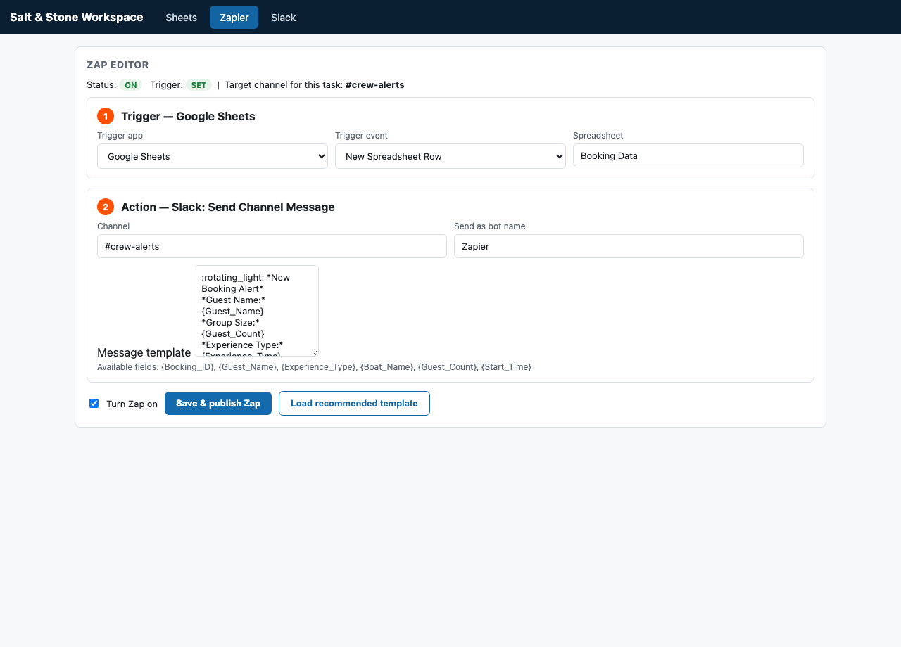
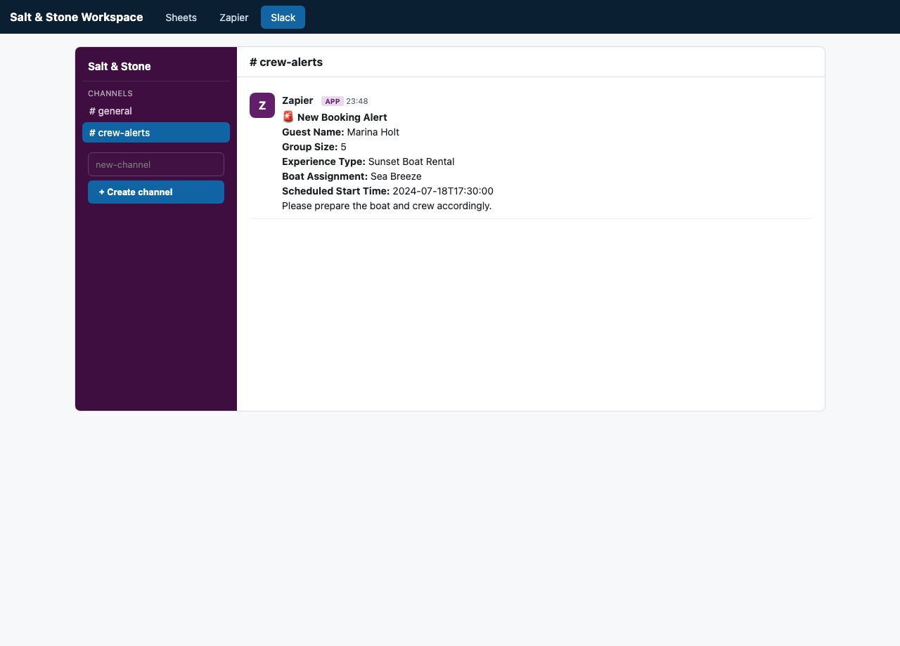

# Salt & Stone RL Environment

A **simulated, resettable computer-use environment** that boots from a *seed* produced by
the extraction pipeline and lets an RL agent attempt a real multi-app task entirely
locally — no real Google Sheets / Slack / Zapier accounts (which are neither resettable
nor deterministic).

It is the environment half of the project. The other half (`../rl_seed_pipeline/`) turns a
screen recording into a seed/curriculum JSON; this half turns that into a live, gradeable
environment.

It is **web-only and episodic**: the long recording is decomposed into a *curriculum* of
small, independently-resettable sub-tasks (build the sheet, create the channel, configure the
Zap trigger, the action, publish it, validate), each with its own initial state and grader. A
thin **Gymnasium adapter** (`gym_env.py`) exposes every episode as a standard `gym.make` id.

## The task represented

> **Set up and validate a Zapier automation that posts a formatted real-time booking alert
> to a Slack channel (`#crew-alerts`) whenever a new row is added to the "Salt and Stone
> Booking" Google Sheet.** — for *Salt & Stone Coastal Tours*.

The full task is solved when the agent configures the automation (Google Sheets *New Row*
trigger → Slack *Send Channel Message* action) targeting `#crew-alerts`, turns it on, and
validates it by adding a new booking row that produces a correctly formatted **"New Booking
Alert"** in `#crew-alerts`. The same task is also sliced into the 6-episode curriculum below,
so an agent can be trained/grade on any single step.

## Episodes (curriculum)

| episode | starts with (overrides) | goal / graded check |
| --- | --- | --- |
| `E1_create_sheet` | empty working sheet + read-only source data | copy all source rows → `working_sheet_populated` |
| `E2_create_channel` | only `#general` exists | create `#crew-alerts` → `channel_exists` |
| `E3_zap_trigger` | sheet populated, channel exists, Zap empty | set Sheets *New Row* trigger → `trigger_configured` |
| `E4_zap_action` | trigger preset | add Slack action + template to `#crew-alerts` → `action_configured` |
| `E5_publish_zap` | trigger+action configured, off | enable the Zap → `zap_enabled` |
| `E6_validate` | Zap live | add a booking → `new_row_added` + `alert_correct` |

Each episode resets to the **cumulative state at its start**, expressed with three override
knobs (`working_sheet_rows`, `channels`, `automation_level`). Episodes are defined in
`apps/episodes.py` (the built-in default), or carried in a seed/curriculum's `episodes[]`
array (what the pipeline emits). Selecting `episode_id=None` runs the full end-to-end task.

## Architecture

```
                          seed.example.json  (the interface contract)
                                   │
                                   ▼
        ┌──────────────────────────────────────────────────────────┐
        │  apps/  — simulated web apps (stdlib http.server)          │
        │                                                            │
        │   state.py    state + automation engine + episode overrides│
        │   episodes.py episode specs (overrides + grader checks)    │
        │   render.py   server-rendered HTML for the apps            │
        │   server.py   HTTP server: UI + REST API + /api/reset --episode │
        │                                                            │
        │   /spreadsheet  editable grid + add-row + read-only source │
        │   /source       read-only source data (web-relabeled WPS)  │
        │   /zapier       Zap editor (trigger + action + enable)     │
        │   /slack        channels + create-channel form             │
        └──────────────────────────────────────────────────────────┘
                                   ▲
                 Playwright (browser)  │  or  requests (headless fallback)
                                   │
        ┌──────────────────────────────────────────────────────────┐
        │  harness/ — the native RL API                              │
        │   environment.py  SaltStoneEnv(episode_id=...): reset/step │
        │                   /reward/is_success + per-episode check registry │
        │   actions.py      action schema + builders                 │
        │   judge.py        OpenAI judge (gpt-4o-mini) + deterministic fallback │
        └──────────────────────────────────────────────────────────┘
                                   ▲
        gym_env.py  (Gymnasium adapter: one env id per episode)
        curriculum_runner.py / smoke_test.py  (per-episode + full-task verification)
```

The web pages are **fully server-rendered** and reflect current state on every GET, and all
mutations are plain `POST` + 303 redirect. This means the *exact same apps* work whether
driven by a real browser (Playwright clicks the form and submit button) or by plain HTTP
(the headless fallback `POST`s the same endpoint), so the task logic and grading are
identical in both modes.

## How it consumes the seed

The environment reads a seed JSON matching the agreed contract (see `seed.example.json`,
created here so this half is never blocked on the pipeline):

```jsonc
{
  "task": { "summary", "goal", "success_criteria", "applications" },
  "initial_state": {
    "business_context", "starting_application",
    "datasets": [ { "name", "columns", "rows": [[...]] } ],
    "accounts", "target_slack_channel", "slack_channels",
    "automation_spec": { "trigger", "action", "message_template", ... }
  },
  "episodes": [                       // optional; defaults to apps/episodes.py
    { "id", "title", "goal", "app",
      "initial_overrides": { "working_sheet_rows", "channels", "automation_level" },
      "checks": [...], "reward_weights": {...}, "success_checks": [...] }
  ]
}
```

`apps/state.py::SimState.from_seed(seed, episode_id)` maps this into runtime state:
- `datasets[0]` → the **read-only source data** *and* (per the episode's
  `working_sheet_rows`) the editable working sheet (empty for `E1`, full otherwise).
- `target_slack_channel` → the channel grading expects (`#crew-alerts`); the episode's
  `channels` override decides whether it exists yet.
- `automation_level` (`none|trigger|trigger_action|full_enabled`) preconfigures the Zap to
  the episode's start; `automation_spec.message_template` is the **recommended template**.

The pipeline emits a ready-to-run curriculum at `../rl_seed_pipeline/outputs/curriculum.json`
(same shape, with `episodes[]`). Point the env at any seed/curriculum with this shape:
`SaltStoneEnv(seed_path=".../curriculum.json", episode_id="E3_zap_trigger")`.

## RL API surface

```python
from harness.environment import SaltStoneEnv

env = SaltStoneEnv(seed_path="seed.example.json", episode_id="E2_create_channel",
                   mode="auto", headless=True)   # episode_id=None → full task
obs  = env.reset()                 # boots apps to the episode's start state
obs  = env.step(action)            # applies an action, returns next observation
r    = env.reward()                # float, shaped 0..1 for the selected episode
done = env.is_success()            # bool, episode completion
grade= env.grade()                 # dict: components, weights, judge detail
env.close()
```

### Actions (plain dicts; see `harness/actions.py`)

High-level (work in both browser and headless modes):

| action | effect |
| --- | --- |
| `{"type":"navigate","app":"spreadsheet"\|"slack"\|"zapier","channel":"#crew-alerts"}` | go to an app |
| `{"type":"add_row","values":{...}}` | add a booking row (fires the Zap if live); `values` optional (auto-generated) |
| `{"type":"create_channel","name":"#crew-alerts"}` | create a Slack channel |
| `{"type":"configure_automation", ...}` | set up the Zap; provide only the fields you mean to change |
| `{"type":"screenshot"}` / `{"type":"noop"}` | capture / no-op |

`configure_automation` fields (all optional, applied only when present so the **trigger** and
**action** can be configured independently): `trigger_app`, `trigger_event`, `trigger_sheet`
(the trigger), `channel`, `message_template`, `bot_name`, `use_recommended_template` (the
action), and `enabled`.

Low-level (browser only), for DOM-level agents:
`{"type":"click","selector":"#add-row-btn"}`, `{"type":"fill","selector":"#zap-channel","text":"#crew-alerts"}`.

Stable selectors: `#add-row-form`, `#cell-<Column>`, `#add-row-btn`, `#create-channel-input`,
`#create-channel-btn`, `#zap-trigger-app`, `#zap-trigger-event`, `#zap-trigger-sheet`,
`#zap-channel`, `#zap-template`, `#zap-bot`, `#zap-enabled`, `#zap-save`, `#zap-load-template`.

### Observation (dict)

```jsonc
{
  "step": 3, "mode": "browser",            // or "backend"
  "url": "http://127.0.0.1:PORT/slack?channel=crew-alerts",
  "screenshot_path": ".../03_navigate.png", // browser mode
  "dom_snapshot_path": ".../03_navigate.html", // headless fallback
  "aria": {...},                            // Playwright accessibility tree (browser mode)
  "html_excerpt": "…",                      // text excerpt (headless fallback)
  "state": {...},                           // full backend state (dataset, slack, automation)
  "reward": 1.0, "success": true,
  "reward_breakdown": {...},                // per-component + judge detail
  "task": {...}
}
```

### Reward shaping & success (per-episode check registry)

Grading is a **registry of named checks**; each episode declares which checks it needs and
their weights. `reward()` is the normalized weighted sum of the episode's passed checks (so it
is always `0..1`); `is_success()` requires every check in the episode's `success_checks`.

| check | meaning |
| --- | --- |
| `working_sheet_populated` | every source booking is present in the working sheet |
| `channel_exists` | the target channel exists |
| `trigger_configured` | trigger = Google Sheets *New Row* on the booking sheet |
| `action_configured` | action = Slack *Send Channel Message* to the target, with a template |
| `zap_enabled` | the Zap is configured **and** turned on, targeting the right channel |
| `new_row_added` | a new booking row was added beyond the seeded rows |
| `alert_correct` | a correctly formatted alert for that booking is in the target channel |

The **full task** (`episode_id=None`) keeps the original weights
(`trigger 0.10, action 0.10, zap_enabled 0.20, new_row 0.10, alert 0.50`) and succeeds on
`zap_enabled + new_row_added + alert_correct`. Each curriculum episode uses just its own
check(s), so a single sub-task is solvable on its own and a do-nothing policy scores `< 1.0`.

### Success judge (`harness/judge.py`)

The alert is graded fuzzily by an **OpenAI model (`gpt-4o-mini`)** that checks the message
conveys the booking (guest name, group size, experience type, boat/vessel, start time + a
"prepare the boat and crew" instruction). The key is loaded from the workspace‑root `.env`
via an absolute path; the secret is never printed. If the API key/network is unavailable or
any call fails, it **degrades gracefully to a deterministic substring/heuristic check** (a
cheap deterministic cross-check is always computed and returned alongside).

## Gymnasium adapter (`gym_env.py`)

A thin wrapper exposes each episode (and the full task) as a standard Gymnasium env:

```python
import gymnasium as gym
import gym_env

gym_env.register_envs()                                  # one id per episode + Full
env = gym.make("SaltStone/E3_zap_trigger-v0")            # ids: SaltStone/<Episode>-v0
obs, info = env.reset()                                  # (obs, info)
obs, reward, terminated, truncated, info = env.step(     # action may be a dict ...
    '{"type":"configure_automation","trigger_app":"google_sheets",'
    '"trigger_event":"new_row","trigger_sheet":"Salt and Stone Booking"}')  # ... or JSON text
```

- **observation_space**: `Dict` of `Text` (`url`, `page_text`, `state_json`, `screenshot_path`, `episode`).
- **action_space**: `Text` holding a JSON-encoded semantic action (`step` also accepts a dict).
- **reward**: per-step *change* in the episode's shaped score (episode return = final score);
  `info["reward_abs"]` carries the absolute score and `info["breakdown"]` the grader detail.
- `terminated` = episode success; `truncated` = `max_steps` reached.

## Running it

```bash
# 1) install (Homebrew python is PEP 668 "externally managed")
python3 -m pip install --break-system-packages -r requirements.txt
NODE_TLS_REJECT_UNAUTHORIZED=0 python3 -m playwright install chromium   # see note below

# 2) per-episode curriculum smoke test (native API + gym.make, oracle + discrimination)
python3 curriculum_runner.py                       # all episodes, deterministic judge
python3 curriculum_runner.py --episode E4_zap_action
python3 curriculum_runner.py --seed ../rl_seed_pipeline/outputs/curriculum.json  # pipeline output
python3 curriculum_runner.py --include-full --llm  # also the full task, OpenAI judge

# 3) full end-to-end smoke test (real Chromium + OpenAI judge)
python3 smoke_test.py
python3 smoke_test.py --backend     # force headless no-browser fallback
python3 smoke_test.py --no-llm      # deterministic judge only (offline)
python3 smoke_test.py --headed      # watch the browser

# run the apps standalone (optionally reset to one episode) to click around yourself
python3 apps/server.py --seed seed.example.json --episode E1_create_sheet --port 8765
#   → http://127.0.0.1:8765/spreadsheet  /source  /zapier  /slack
```

## Verification

- `curriculum_runner.py` proves, for every episode, that it (1) resets to a state where the
  goal is *not* yet met, (2) is solved by a minimal oracle (`is_success()` and `reward==1.0`),
  (3) discriminates a deliberately wrong attempt, and (4) round-trips through `gym.make`. It
  passes against both `seed.example.json` and the pipeline-generated `curriculum.json`. The
  report is written to `outputs/curriculum_report.json`.
- `smoke_test.py` runs the full task end-to-end (reset → configure → add row → confirm alert
  in `#crew-alerts`) and writes `outputs/initial_state.*`, `outputs/success_state.*`, and
  `outputs/smoke_report.json`.

| initial (spreadsheet) | zap editor | success (#crew-alerts) |
| --- | --- | --- |
|  |  |  |

## File layout

```
rl_env/
  seed.example.json     # seed contract (Salt & Stone, 15 rows, automation_spec)
  requirements.txt
  README.md
  apps/
    state.py            # state model + automation engine + episode overrides + source data
    episodes.py         # episode specs (initial_overrides + grader checks) + defaults
    render.py           # server-rendered HTML (spreadsheet / source / slack / zapier)
    server.py           # http.server app: UI + REST API + /api/reset + --episode
  harness/
    environment.py      # SaltStoneEnv(episode_id=...): reset/step + check-registry grading
    actions.py          # action schema + builders (navigate/add_row/create_channel/...)
    judge.py            # OpenAI judge + deterministic fallback
  gym_env.py            # Gymnasium adapter: one env id per episode
  curriculum_runner.py  # per-episode oracle smoke test (native API + gym.make)
  smoke_test.py         # full-task end-to-end verification
  outputs/              # screenshots / HTML snapshots / reports
```

## Environment notes / blockers

- **`pip3` vs `python3`**: `pip3` here targets a *different* interpreter than `python3`
  (Command Line Tools vs Homebrew). Always install with `python3 -m pip` so the smoke test's
  interpreter sees the package.
- **PEP 668**: Homebrew's Python is externally managed; installs need
  `--break-system-packages` (consistent with how the pre-existing deps were installed).
- **Chromium download cert error (resolved)**: the download initially failed with
  `UNABLE_TO_GET_ISSUER_CERT_LOCALLY` (corporate TLS interception). Running the *download*
  with `NODE_TLS_REJECT_UNAUTHORIZED=0` fixed it. This only affects the one-time binary
  download — launching the browser at runtime needs no network and no flag. If a machine
  cannot download Chromium at all, the env still runs end-to-end via `mode="backend"`.
